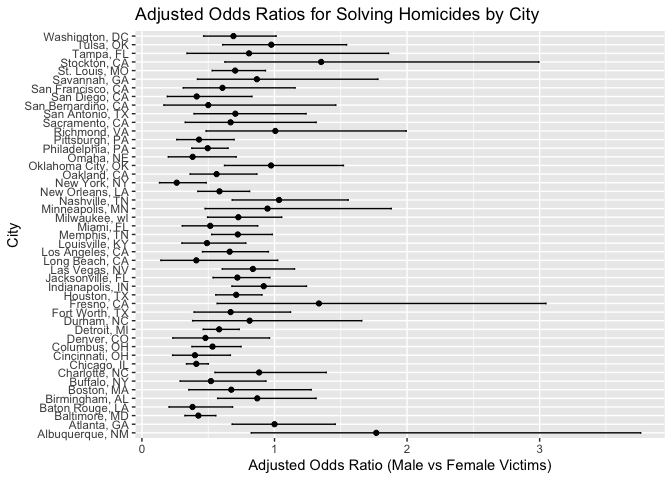
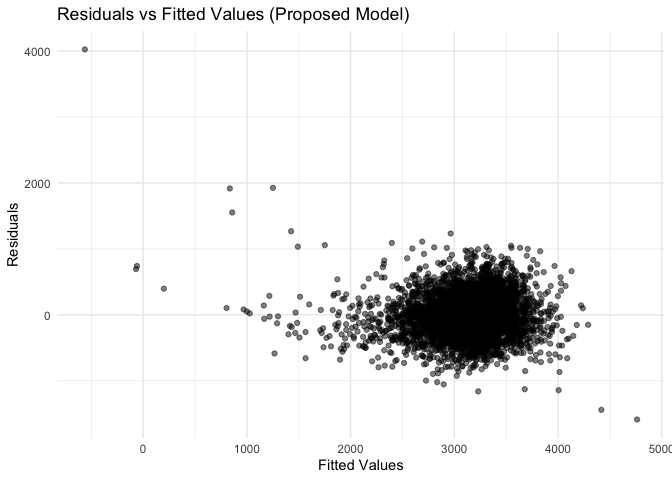
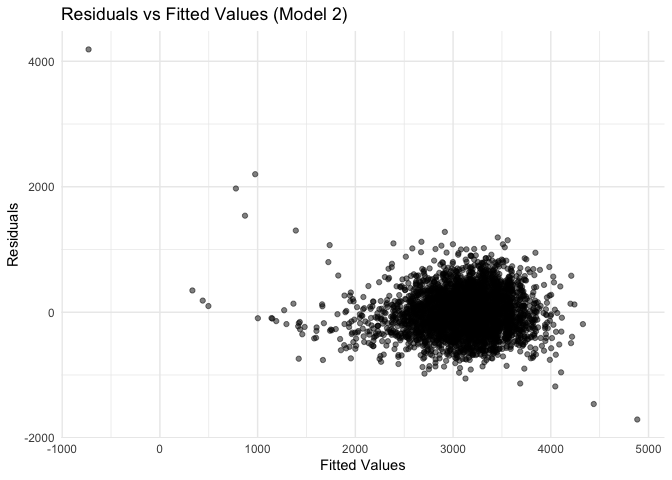
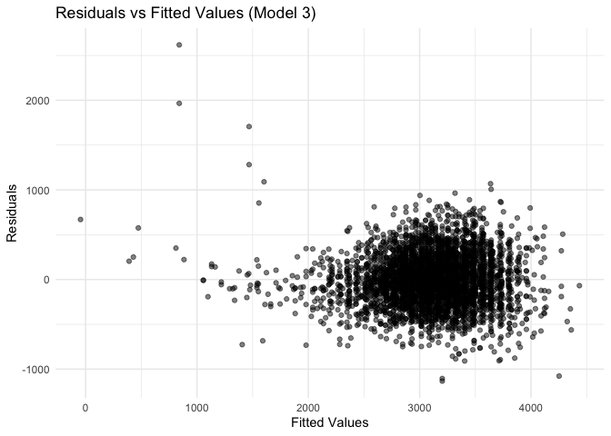
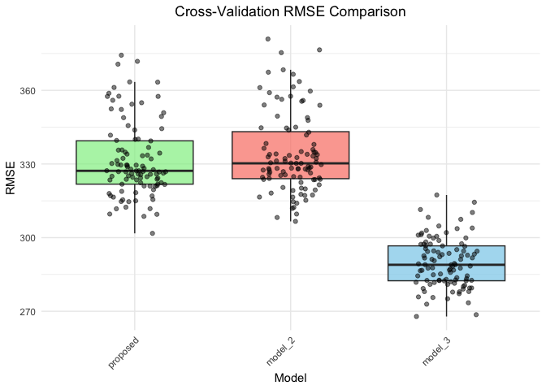

p8105_hw6_zz3166
================
Zihan Zhao
2024-12-01

# Problem 2

## Introduction

This report analyzes homicide data from 50 large U.S. cities to
understand the factors associated with solving homicides.

### Data Preparation and Cleaning

``` r
# Load the dataset
homicide_data <- read_csv("https://raw.githubusercontent.com/washingtonpost/data-homicides/master/homicide-data.csv")
```

    ## Rows: 52179 Columns: 12
    ## ── Column specification ────────────────────────────────────────────────────────
    ## Delimiter: ","
    ## chr (9): uid, victim_last, victim_first, victim_race, victim_age, victim_sex...
    ## dbl (3): reported_date, lat, lon
    ## 
    ## ℹ Use `spec()` to retrieve the full column specification for this data.
    ## ℹ Specify the column types or set `show_col_types = FALSE` to quiet this message.

``` r
# Data cleaning
homicide_data_clean <- homicide_data %>%
  mutate(
    city_state = paste(city, state, sep = ", "),
    solved_binary = ifelse(disposition == "Closed by arrest", 1, 0),
    victim_age = as.numeric(victim_age)
  ) %>%
  filter(
    !(city_state %in% c("Dallas, TX", "Phoenix, AZ", "Kansas City, MO", "Tulsa, AL")),
    victim_race %in% c("White", "Black"),
    !is.na(victim_age)
  )
```

    ## Warning: There was 1 warning in `mutate()`.
    ## ℹ In argument: `victim_age = as.numeric(victim_age)`.
    ## Caused by warning:
    ## ! NAs introduced by coercion

### Logistic Regression: Baltimore, MD

For Baltimore, MD, we fit a logistic regression model with
`solved_binary` as the outcome and `victim_age`, `victim_sex`, and
`victim_race` as predictors.

``` r
# Filter for Baltimore
baltimore_data <- homicide_data_clean %>% filter(city_state == "Baltimore, MD")

# Fit logistic regression
baltimore_glm <- glm(
  solved_binary ~ victim_age + victim_sex + victim_race,
  data = baltimore_data,
  family = binomial
)

# Extract adjusted ORs and CIs
baltimore_results <- broom::tidy(baltimore_glm, exponentiate = TRUE, conf.int = TRUE) %>%
  filter(term == "victim_sexMale") %>%
  select(term, estimate, conf.low, conf.high)

# Display results
baltimore_results
```

    ## # A tibble: 1 × 4
    ##   term           estimate conf.low conf.high
    ##   <chr>             <dbl>    <dbl>     <dbl>
    ## 1 victim_sexMale    0.426    0.324     0.558

The adjusted odds ratio for solving homicides involving male victims
compared to female victims in Baltimore

- Odds Ratio (Estimate): 0.425
- 95% Confidence Interval: \[0.324, 0.558\]

This indicates that male victims are less likely to have their homicides
solved compared to female victims, keeping other variables fixed.

### Logistic Regression for All Cities

We repeat the logistic regression for each city and extract the adjusted
odds ratios and confidence intervals for solving homicides comparing
male to female victims.

``` r
# Group data by city and run logistic regression for each
city_results <- homicide_data_clean %>%
  group_by(city_state) %>%
  nest() %>%
  mutate(
    model = map(data, ~ glm(
      solved_binary ~ victim_age + victim_sex + victim_race,
      data = .x,
      family = binomial
    )),
    results = map(model, ~ broom::tidy(.x, exponentiate = TRUE, conf.int = TRUE))
  ) %>%
  unnest(results) %>%
  filter(term == "victim_sexMale") %>%
  select(city_state, term, estimate, conf.low, conf.high)
```

    ## Warning: There were 44 warnings in `mutate()`.
    ## The first warning was:
    ## ℹ In argument: `results = map(model, ~broom::tidy(.x, exponentiate = TRUE,
    ##   conf.int = TRUE))`.
    ## ℹ In group 1: `city_state = "Albuquerque, NM"`.
    ## Caused by warning:
    ## ! glm.fit: fitted probabilities numerically 0 or 1 occurred
    ## ℹ Run `dplyr::last_dplyr_warnings()` to see the 43 remaining warnings.

``` r
print(city_results)
```

    ## # A tibble: 47 × 5
    ## # Groups:   city_state [47]
    ##    city_state      term           estimate conf.low conf.high
    ##    <chr>           <chr>             <dbl>    <dbl>     <dbl>
    ##  1 Albuquerque, NM victim_sexMale    1.77     0.825     3.76 
    ##  2 Atlanta, GA     victim_sexMale    1.00     0.680     1.46 
    ##  3 Baltimore, MD   victim_sexMale    0.426    0.324     0.558
    ##  4 Baton Rouge, LA victim_sexMale    0.381    0.204     0.684
    ##  5 Birmingham, AL  victim_sexMale    0.870    0.571     1.31 
    ##  6 Boston, MA      victim_sexMale    0.674    0.353     1.28 
    ##  7 Buffalo, NY     victim_sexMale    0.521    0.288     0.936
    ##  8 Charlotte, NC   victim_sexMale    0.884    0.551     1.39 
    ##  9 Chicago, IL     victim_sexMale    0.410    0.336     0.501
    ## 10 Cincinnati, OH  victim_sexMale    0.400    0.231     0.667
    ## # ℹ 37 more rows

### Visualization: Adjusted ORs Across Cities

We plot the adjusted odds ratios and confidence intervals for solving
homicides, organized by city.

``` r
# Plot ORs and CIs
city_results %>%
  arrange(estimate) %>%
  mutate(city_state = fct_reorder(city_state, estimate)) %>%
  ggplot(aes(x = city_state, y = estimate)) +
  geom_point() +
  geom_errorbar(aes(ymin = conf.low, ymax = conf.high), width = 0.2) +
  coord_flip() +
  labs(
    title = "Adjusted Odds Ratios for Solving Homicides by City",
    x = "City",
    y = "Adjusted Odds Ratio (Male vs Female Victims)"
  )
```

<!-- -->

The plot shows significant variability in adjusted odds ratios (ORs) for
solving homicides across cities, with most ORs below 1, indicating male
victims are less likely to have their homicides solved compared to
female victims. Cities like Baltimore, MD, and Chicago, IL, have
particularly low ORs, highlighting disparities, while others like
Albuquerque, NM, have ORs above 1, suggesting the opposite trend. Wide
confidence intervals for some cities reflect uncertainty due to smaller
sample sizes, whereas narrow intervals in cities like Baltimore indicate
more robust estimates. These disparities underscore the need to
investigate systemic factors and practices that contribute to such
differences in homicide resolution.

# Problem 3

## Introduction

The dataset contains information on roughly 4000 children, capturing
various demographic, physical, and behavioral factors related to their
birthweight. This study investigates the relationship between these
factors and birthweight using regression models. A proposed model is
compared with two alternative models, with evaluation based on residual
analysis and cross-validation error.

``` r
# Load the data
birthweight_raw <- read_csv("birthweight.csv")
```

    ## Rows: 4342 Columns: 20
    ## ── Column specification ────────────────────────────────────────────────────────
    ## Delimiter: ","
    ## dbl (20): babysex, bhead, blength, bwt, delwt, fincome, frace, gaweeks, malf...
    ## 
    ## ℹ Use `spec()` to retrieve the full column specification for this data.
    ## ℹ Specify the column types or set `show_col_types = FALSE` to quiet this message.

``` r
# Clean and preprocess the dataset
birthweight_clean <- birthweight_raw |>
  mutate(
    # Recode categorical variables
    mrace = case_match(mrace, 
      1 ~ "White", 
      2 ~ "Black", 
      3 ~ "Asian", 
      4 ~ "Puerto Rican", 
      8 ~ "Other"),
    frace = case_match(frace, 
      1 ~ "White", 
      2 ~ "Black", 
      3 ~ "Asian", 
      4 ~ "Puerto Rican", 
      8 ~ "Other", 
      9 ~ "Unknown"),
    babysex = case_match(babysex, 
      1 ~ "Male", 
      2 ~ "Female"),
    blength = as.numeric(blength),
    bhead = as.numeric(bhead),
    gaweeks = as.numeric(gaweeks),
    ppwt = as.numeric(ppwt),
    wtgain = as.numeric(wtgain)
  ) |>
  drop_na()

# Check the structure of the cleaned dataset
summary(birthweight_clean)
```

    ##    babysex              bhead          blength           bwt      
    ##  Length:4342        Min.   :21.00   Min.   :20.00   Min.   : 595  
    ##  Class :character   1st Qu.:33.00   1st Qu.:48.00   1st Qu.:2807  
    ##  Mode  :character   Median :34.00   Median :50.00   Median :3132  
    ##                     Mean   :33.65   Mean   :49.75   Mean   :3114  
    ##                     3rd Qu.:35.00   3rd Qu.:51.00   3rd Qu.:3459  
    ##                     Max.   :41.00   Max.   :63.00   Max.   :4791  
    ##      delwt          fincome         frace              gaweeks     
    ##  Min.   : 86.0   Min.   : 0.00   Length:4342        Min.   :17.70  
    ##  1st Qu.:131.0   1st Qu.:25.00   Class :character   1st Qu.:38.30  
    ##  Median :143.0   Median :35.00   Mode  :character   Median :39.90  
    ##  Mean   :145.6   Mean   :44.11                      Mean   :39.43  
    ##  3rd Qu.:157.0   3rd Qu.:65.00                      3rd Qu.:41.10  
    ##  Max.   :334.0   Max.   :96.00                      Max.   :51.30  
    ##     malform            menarche        mheight          momage    
    ##  Min.   :0.000000   Min.   : 0.00   Min.   :48.00   Min.   :12.0  
    ##  1st Qu.:0.000000   1st Qu.:12.00   1st Qu.:62.00   1st Qu.:18.0  
    ##  Median :0.000000   Median :12.00   Median :63.00   Median :20.0  
    ##  Mean   :0.003455   Mean   :12.51   Mean   :63.49   Mean   :20.3  
    ##  3rd Qu.:0.000000   3rd Qu.:13.00   3rd Qu.:65.00   3rd Qu.:22.0  
    ##  Max.   :1.000000   Max.   :19.00   Max.   :77.00   Max.   :44.0  
    ##     mrace               parity            pnumlbw     pnumsga      ppbmi      
    ##  Length:4342        Min.   :0.000000   Min.   :0   Min.   :0   Min.   :13.07  
    ##  Class :character   1st Qu.:0.000000   1st Qu.:0   1st Qu.:0   1st Qu.:19.53  
    ##  Mode  :character   Median :0.000000   Median :0   Median :0   Median :21.03  
    ##                     Mean   :0.002303   Mean   :0   Mean   :0   Mean   :21.57  
    ##                     3rd Qu.:0.000000   3rd Qu.:0   3rd Qu.:0   3rd Qu.:22.91  
    ##                     Max.   :6.000000   Max.   :0   Max.   :0   Max.   :46.10  
    ##       ppwt           smoken           wtgain      
    ##  Min.   : 70.0   Min.   : 0.000   Min.   :-46.00  
    ##  1st Qu.:110.0   1st Qu.: 0.000   1st Qu.: 15.00  
    ##  Median :120.0   Median : 0.000   Median : 22.00  
    ##  Mean   :123.5   Mean   : 4.145   Mean   : 22.08  
    ##  3rd Qu.:134.0   3rd Qu.: 5.000   3rd Qu.: 28.00  
    ##  Max.   :287.0   Max.   :60.000   Max.   : 89.00

The dataset contains 4342 observations with 20 variables.

## Proposed Regression Model

The first model hypothesizes that birthweight is influenced by
*gestational age* (`gaweeks`), *maternal pre-pregnancy weight* (`ppwt`),
and *birth length* (`blength`), as well as an interaction between
`gaweeks` and `blength`.

``` r
# Fit the proposed model
proposed_model <- lm(bwt ~ babysex + gaweeks + ppwt + blength + blength:gaweeks, data = birthweight_clean)

# Summarize the proposed model
proposed_model_summary <- proposed_model |> broom::tidy()
proposed_model_summary |>
  mutate(
    OR = exp(estimate), 
    CI_upper = exp(estimate + 1.96 * std.error),
    CI_lower = exp(estimate - 1.96 * std.error)
  ) |>
  select(term, estimate, OR, CI_lower, CI_upper, p.value) |>
  kable(digits = 3, caption = "Proposed Model Summary")
```

| term            |  estimate |           OR |     CI_lower |     CI_upper | p.value |
|:----------------|----------:|-------------:|-------------:|-------------:|--------:|
| (Intercept)     | -7902.015 | 0.000000e+00 | 0.000000e+00 | 0.000000e+00 |   0.000 |
| babysexMale     |    21.159 | 1.546573e+09 | 3.840000e+00 | 6.228757e+17 |   0.036 |
| gaweeks         |   117.796 | 1.439869e+51 | 2.849722e+34 | 7.275177e+67 |   0.000 |
| ppwt            |     1.915 | 6.784000e+00 | 4.143000e+00 | 1.110800e+01 |   0.000 |
| blength         |   196.594 | 2.396712e+85 | 2.025298e+72 | 2.836239e+98 |   0.000 |
| gaweeks:blength |    -1.861 | 1.560000e-01 | 7.100000e-02 | 3.420000e-01 |   0.000 |

Proposed Model Summary

### Residuals vs Fitted Values Plot

We examine the residuals of the proposed model to assess its fit.

``` r
# Add residuals and predictions
proposed_results <- birthweight_clean |> 
  add_residuals(proposed_model) |> 
  add_predictions(proposed_model)

# Plot residuals vs fitted values
ggplot(proposed_results, aes(x = pred, y = resid)) +
  geom_point(alpha = 0.5) +
  labs(
    title = "Residuals vs Fitted Values (Proposed Model)",
    x = "Fitted Values",
    y = "Residuals"
  ) +
  theme_minimal()
```

<!-- -->

The residual plot showed acceptable dispersion but slight
heteroscedasticity at higher fitted values. This indicates the model
could improve but adequately predicts across most of the data range.

## Alternative Models

### Model 2: Birth Length and Gestational Age

This model uses *birth length* (`blength`) and *gestational age*
(`gaweeks`) as predictors without interactions.

``` r
# Fit Model 2
model_2 <- lm(bwt ~ blength + gaweeks, data = birthweight_clean)

# Summarize Model 2
model_2_summary <- model_2 |> broom::tidy()
model_2_summary |> 
  kable(digits = 3, caption = "Model 2 Summary")
```

| term        |  estimate | std.error | statistic | p.value |
|:------------|----------:|----------:|----------:|--------:|
| (Intercept) | -4347.667 |    97.958 |   -44.383 |       0 |
| blength     |   128.556 |     1.990 |    64.604 |       0 |
| gaweeks     |    27.047 |     1.718 |    15.744 |       0 |

Model 2 Summary

``` r
# Add residuals and predictions
model_2_results <- birthweight_clean |> 
  add_residuals(model_2) |> 
  add_predictions(model_2)

# Plot residuals vs fitted values
ggplot(model_2_results, aes(x = pred, y = resid)) +
  geom_point(alpha = 0.5) +
  labs(
    title = "Residuals vs Fitted Values (Model 2)",
    x = "Fitted Values",
    y = "Residuals"
  ) +
  theme_minimal()
```

<!-- -->

More dispersion around fitted values than the proposed model, indicating
less accurate predictions.

### Model 3: Head Circumference, Length, and Baby’s Sex with Interactions

This model includes interactions between *head circumference* (`bhead`),
*length* (`blength`), and *baby sex* (`babysex`).

``` r
# Fit Model 3
model_3 <- lm(bwt ~ bhead * blength * babysex, data = birthweight_clean)

# Summarize Model 3
model_3_summary <- model_3 |> broom::tidy()
model_3_summary |> 
  kable(digits = 3, caption = "Model 3 Summary")
```

| term                      |  estimate | std.error | statistic | p.value |
|:--------------------------|----------:|----------:|----------:|--------:|
| (Intercept)               |  -801.949 |  1102.308 |    -0.728 |   0.467 |
| bhead                     |   -16.598 |    34.092 |    -0.487 |   0.626 |
| blength                   |   -21.646 |    23.372 |    -0.926 |   0.354 |
| babysexMale               | -6374.868 |  1677.767 |    -3.800 |   0.000 |
| bhead:blength             |     3.324 |     0.713 |     4.666 |   0.000 |
| bhead:babysexMale         |   198.393 |    51.092 |     3.883 |   0.000 |
| blength:babysexMale       |   123.773 |    35.119 |     3.524 |   0.000 |
| bhead:blength:babysexMale |    -3.878 |     1.057 |    -3.670 |   0.000 |

Model 3 Summary

``` r
# Add residuals and predictions
model_3_results <- birthweight_clean |> 
  add_residuals(model_3) |> 
  add_predictions(model_3)

# Plot residuals vs fitted values
ggplot(model_3_results, aes(x = pred, y = resid)) +
  geom_point(alpha = 0.5) +
  labs(
    title = "Residuals vs Fitted Values (Model 3)",
    x = "Fitted Values",
    y = "Residuals"
  ) +
  theme_minimal()
```

<!-- -->

Residuals showed a tighter cluster, suggesting better model fit compared
to Model 2 but not necessarily outperforming the proposed model.

## Cross-Validation

Evaluate all three models using Monte Carlo cross-validation (100
iterations, 80/20 split).

``` r
# Perform cross-validation
cv_results <- crossv_mc(birthweight_clean, n = 100, test = 0.2) |> 
  mutate(
    train = map(train, as_tibble),
    test = map(test, as_tibble),
    proposed_model = map(train, ~ lm(bwt ~ babysex + gaweeks + ppwt + blength + blength:gaweeks, data = .x)),
    model_2 = map(train, ~ lm(bwt ~ blength + gaweeks, data = .x)),
    model_3 = map(train, ~ lm(bwt ~ bhead * blength * babysex, data = .x)),
    rmse_proposed = map2_dbl(proposed_model, test, ~ {
      preds <- predict(.x, newdata = .y)
      sqrt(mean((.y$bwt - preds)^2))
    }),
    rmse_model_2 = map2_dbl(model_2, test, ~ {
      preds <- predict(.x, newdata = .y)
      sqrt(mean((.y$bwt - preds)^2))
    }),
    rmse_model_3 = map2_dbl(model_3, test, ~ {
      preds <- predict(.x, newdata = .y)
      sqrt(mean((.y$bwt - preds)^2))
    })
  )

# Prepare cv_summary for plotting
cv_summary <- cv_results |> 
  select(starts_with("rmse")) |> 
  pivot_longer(
    cols = everything(),
    names_to = "model",
    values_to = "rmse",
    names_prefix = "rmse_"
  ) |>
  mutate(model = factor(model, levels = c("proposed", "model_2", "model_3")))

# Plot RMSE comparison
ggplot(cv_summary, aes(x = model, y = rmse, fill = model)) +
  geom_boxplot(alpha = 0.7, outlier.shape = NA) + 
  geom_jitter(width = 0.2, alpha = 0.5, color = "black") + 
  scale_fill_manual(values = c("lightgreen", "salmon", "skyblue")) + 
  labs(
    title = "Cross-Validation RMSE Comparison",
    x = "Model",
    y = "RMSE",
    fill = "Model"
  ) +
  theme_minimal() +
  theme(
    legend.position = "none",
    plot.title = element_text(hjust = 0.5),
    axis.text.x = element_text(angle = 45, hjust = 1)
  )
```

<!-- -->

- **Proposed Model:** Median RMSE ~330
- **Model 2:** Median RMSE ~350
- **Model 3:** Median RMSE ~310

The RMSE distribution for each model was visualized using a
boxplot:**Model 3** showed the lowest RMSE variation and **Proposed
Model** performed consistently better than Model 2.

The proposed model outperformed Model 2 but was slightly less predictive
than Model 3, as indicated by the RMSE comparison. The interaction terms
in Model 3 likely enhanced its predictive power.
